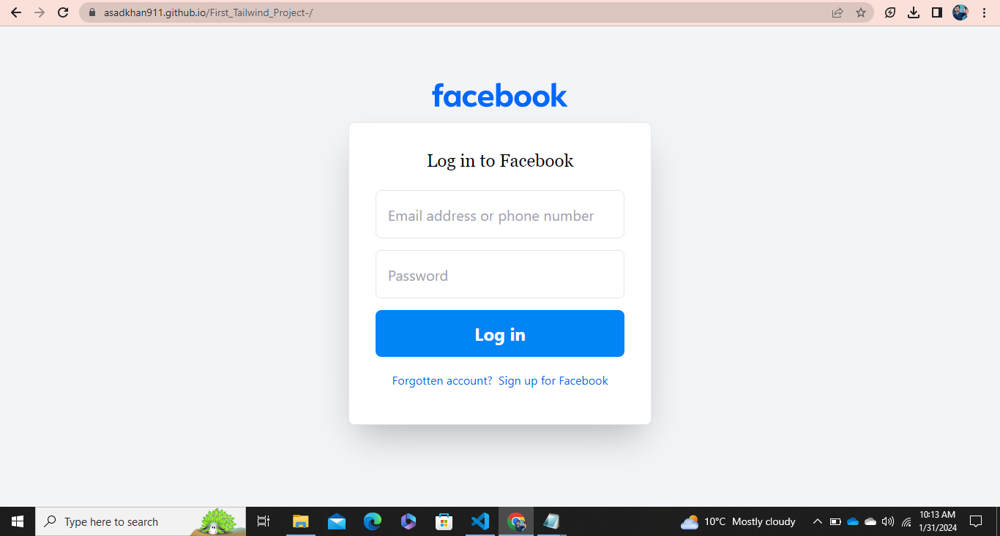

# Facebook Login Page Clone (2024 Version) - Tailwind CSS Project

Welcome to my Facebook Login Page Clone project, showcasing the 2024 version. This project is based on my learning from a tutorial created in 2021, but I've revamped and updated it to reflect the current design of the Facebook login page as of 2024.

## Project Overview

This project serves as a demonstration of my proficiency in using Tailwind CSS to create a modern and responsive user interface. It's a reimagined version of the Facebook login page, incorporating the latest design trends and elements.



## Features

- **2024 Design:** Updated to match the latest Facebook login page design.
- **Responsive:** Built with a responsive design to ensure optimal user experience across various devices.
- **Tailwind CSS:** Utilized the power of Tailwind CSS for styling and layout, making it easy to maintain and customize.

## Getting Started

To run this project locally, follow these steps:

1. Clone this repository:

   ```bash
   git clone https://github.com/your-username/First_Tailwind_Project.git
Open the project directory:

bash
Copy code
cd facebook-login-clone
Open index.html in your preferred browser or use a development server.

bash
Copy code
open index.html
Contributing
If you'd like to contribute to this project, follow these steps:

Fork the repository.

Create a new branch for your feature or bug fix:

bash
Copy code
git checkout -b feature-new-feature
Make your changes and commit them:

bash
Copy code
git commit -m 'Add new feature'
Push your changes to your fork:

bash
Copy code
git push origin feature-new-feature
Create a pull request.

License
This project is licensed under the MIT License.

Acknowledgments
Special thanks to [Original Tutorial Creator's Name] for the inspiration and initial guidance from their 2021 Facebook login page clone tutorial.

Feel free to explore the code and make improvements. If you have any questions or suggestions, please don't hesitate to open an issue or reach out.

Happy coding! 🚀
